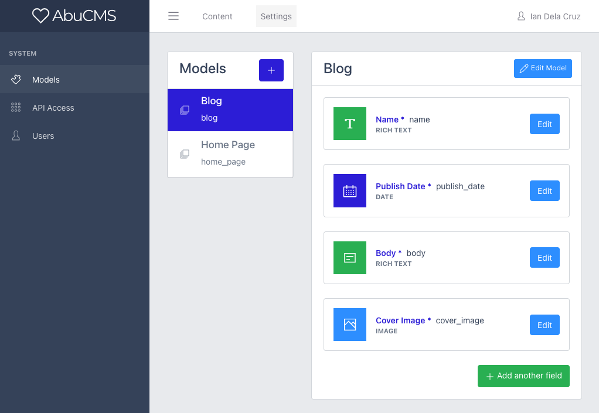
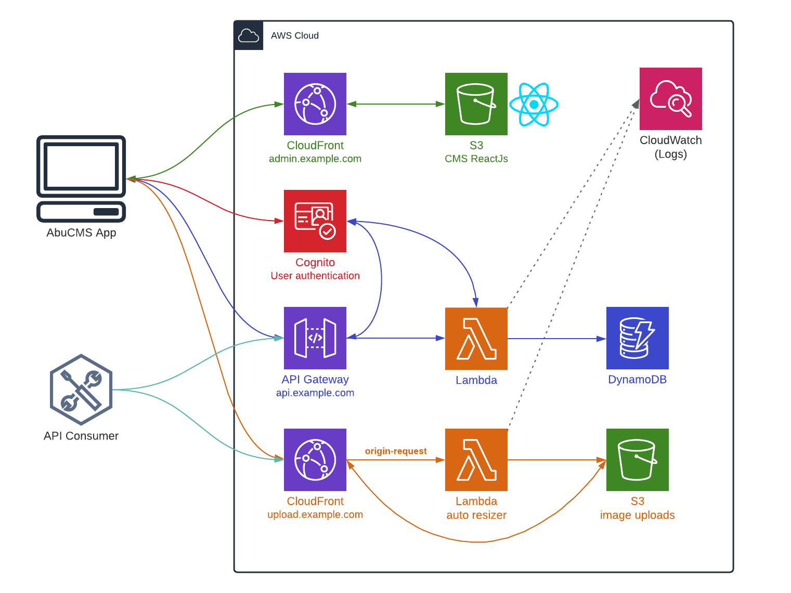

# Abu CMS

Open-source serverless headless CMS. Deployed in AWS infrastructure.



AbuCMS is an easy to use content manager making them available via API.

- Bring your data anywhere - Central location for all your content. Accessible to anywhere via REST API.
- Zero-cost - As long you are within the AWS free-tier limit, you'll be paying $0 forever. Even if you go above the free-tier, cost will be minimal and it will be a pay-per-use model.
- No servers needed - Services used are all serverless technologies which means you don't have to worry about performance, scalability, security and cost.

## Infrastructure



## Requirements

- Operating system with bash - MacOS or Linux
- [aws cli](https://aws.amazon.com/cli/) with working [named profile](https://docs.aws.amazon.com/cli/latest/userguide/cli-configure-profiles.html)
- [nodejs](https://nodejs.org/en/)
- [yarn](https://yarnpkg.com/)
- openssl for generating random string

## Local Development

You'll need [docker](https://www.docker.com/) installed for running [local dynamodb](https://hub.docker.com/r/amazon/dynamodb-local).

1. Clone this project and install packages

   ```bash
   git clone https://github.com/kdcio/abu.git
   cd abu
   yarn
   ```

2. Create `config/dev.yml` and add `PROJECT_NAME`, `REGION` and `PROFILE`.

   ```yaml
   PROJECT_NAME: myproject.com
   REGION: ap-southeast-1
   PROFILE: dev
   FIRST_USER_EMAIL: juan@myproject.com
   ```

   `PROJECT_NAME` will be referenced in all resources used in AWS. It must be unique with only letters and numbers. It should also be unique for S3 bucket name and cognito pool client domain usage. I recommend using a subdomain like `admin-dev.myproject.com`.

   `REGION` is the [AWS Region](https://docs.aws.amazon.com/AmazonRDS/latest/UserGuide/Concepts.RegionsAndAvailabilityZones.html) you want your application to be deployed.

   `PROFILE` is used by AWS CLI to identify who you are. Here's how you configure [named profiles](https://docs.aws.amazon.com/cli/latest/userguide/cli-configure-profiles.html).

3. Run local setup script

   ```bash
   yarn setup:local
   ```

   This will create cognito resources in your AWS account and then run a local dynamodb.

   A temporary password will be sent to your email.

   Note that the script will append config variables to `config/dev.yml` and `packages/cms/.env` (this file will be created automatically).

4. Run the API, CMS and S3 using [concurrently](https://www.npmjs.com/package/concurrently)

   ```bash
   yarn start
   ```

   You can also run them separately `yarn start:api` and `yarn start:cms` for easier debugging.

Here are the services that will be running:

1. [http://localhost:8060/](http://localhost:8060/) - CMS
2. [http://localhost:8061/](http://localhost:8061/) - API
3. [http://localhost:8062/](http://localhost:8062/) - DynamoDB local
4. [http://localhost:8063/](http://localhost:8063/) - [DynamoDB manager](https://github.com/YoyaTeam/dynamodb-manager)
5. [http://localhost:8064/](http://localhost:8064) - S3 local

## Deployment using S3 and CloudFront without domain name

1. Clone this project and install packages

   ```bash
   git clone https://github.com/kdcio/abu.git
   cd abu
   yarn
   ```

2. Create `config/prod.yml` and add `PROJECT_NAME`, `REGION` and `PROFILE`.

   ```yaml
   PROJECT_NAME: admin.myproject.com
   UPLOAD_BUCKET: admin-upload.myproject.com
   REGION: ap-southeast-1
   PROFILE: my-production-profile
   FIRST_USER_EMAIL: juan@myproject.com
   ```

   `PROJECT_NAME` will be referenced in all resources used in AWS. It must be unique with only letters and numbers. It should also be unique for S3 bucket name and cognito pool client domain usage. I recommend using a subdomain like `admin.myproject.com`.

   `UPLOAD_BUCKET` will be an S3 bucket to host file uploads.

   `REGION` is the [AWS Region](https://docs.aws.amazon.com/AmazonRDS/latest/UserGuide/Concepts.RegionsAndAvailabilityZones.html) you want your application to be deployed.

   `PROFILE` is used by AWS CLI to identify who you are. Here's how you configure [named profiles](https://docs.aws.amazon.com/cli/latest/userguide/cli-configure-profiles.html).

3. Run deploy script

   ```bash
   yarn deploy prod
   ```

   The script will take about 20 minutes to finish to provisioning everything.

   Here's a list of AWS resources that will be provisioned:

   - CMS Website Stack
     - CloudFront
     - S3
   - API Stack
     - Lambda
     - API Gateway
     - CloudWatch
   - Upload Stack
     - CloudFront
     - S3
     - Lambda Edge
   - User Management Stack
     - Cognito
   - Database Stack
     - DynamoDB

   All of the stacks will use CloudFormation and S3 for deployment.

   A temporary password will be sent to your email.

   Note that the script will append config variables to `config/prod.yml` and `packages/cms/.env.production.local` (this file will be created automatically).

   If all goes well, the script should output where you can find the CMS.

   **Enjoy!!!**
